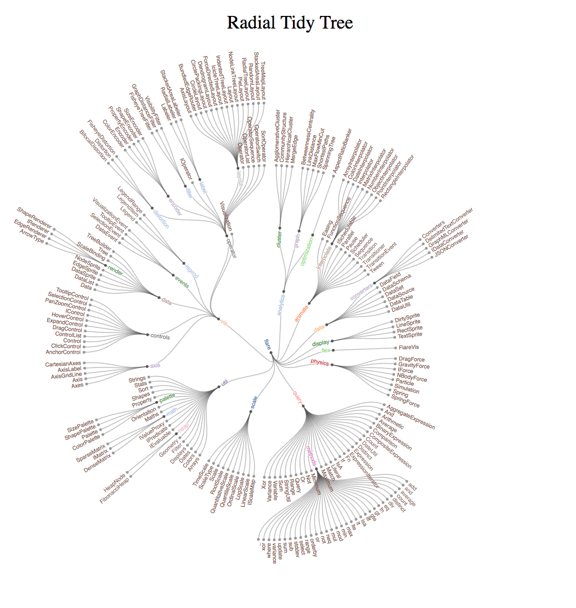

# Radial Tidy Tree

  
> This graph is used to visualize nested data. The root of data presents in the center, and more nested data present the more outer area. Data within the same level have the same radius.

## Table of Methods
|Method|Parameter|Description|Default|
|---|---|---|---|
|width|integer width value|sets the width of window|980|
|height|integer height value|sets the height of window|1100|
|color|string color value|sets the color of text|"d3.schemeCategory20"
|dotSize|integer size value|sets the size of dots|2.5|
|title|string title|sets the title of graph|"Radial Tidy Tree"|
|scale|integer between 1~10|sets the size of graph|2|